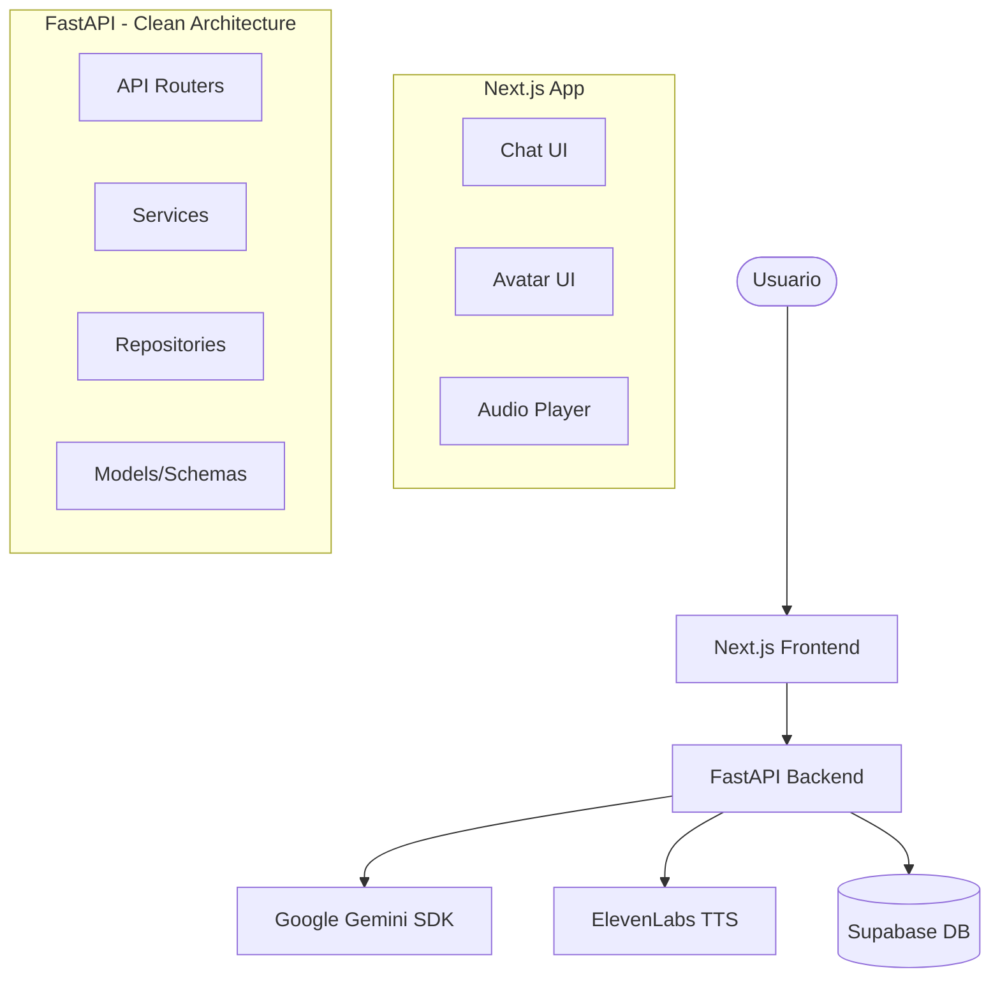

# Arquitectura de PersonaAI

El sistema se divide en dos componentes principales: Frontend y Backend, usando Supabase como capa de persistencia y servicios externos para IA.

## Diagrama de la Arquitectura

## Patrones de Diseño
- **Clean Architecture** en el backend. Las peticiones entran por `routers`, la lógica de negocio se procesa en `services`, y el acceso a base de datos ocurre en `repositories`.
- **Componentes Modulares** en frontend, aislando UI (`components/ui`), features (`components/chat`) y el manejo de estado global con Zustand (`store/`).
- **Base de datos Relacional** centralizada en Supabase, manejada vía SQLAlchemy/Alembic desde Python.
